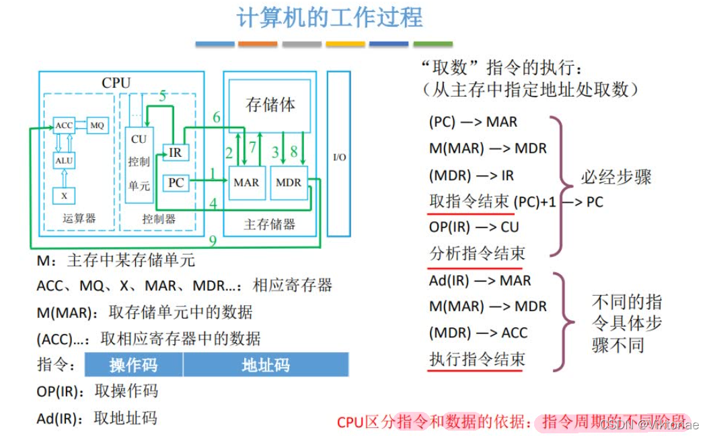

# 计算机组成原理
## 1计算机系统概述
### 1.1计算机发展历程
1 什么是计算机系统 硬件+软件
2 硬件的发展

- **机器字长** ：计算机 **一次** 整数运算 所能处理的 二进制位数

3 软件的发展
4 目前的发展趋势

### 1.2计算机硬件的基本组成
#### 早期冯诺依曼机的结构
- “**存储程序**”的概念是指将指令以二进制代码的形式事先输入计算机的主存储器（内存），然后按其在存储器中的首地址执行程序的第一条指令，以后就按该程序的规定顺序执行其他指令，直至程序执行结束。
	

- 对于同一个功能，我们既可以用软件也可以用硬件来实现，通常，用软件实现成本更低，但效率也更低

#### 现代计算机结构

- 主存：内存
- 辅存：机械硬盘、固态硬盘

### 1.3 各个硬件的工作原理

#### 1 主存储器

- 既可以写，也可以读

- 数据在存储体内按地址存储
- 存储体是由一个个存储单元组成的
- 存储字：存储单元中二进制代码的集合
- 存储字长：存储单元中二进制代码的位数 8bit的整数倍
- 存储元：电容

#### 2 运算器

ACC：寄存器，累加器

MQ：寄存器，乘商

X：寄存器

ALU：算术逻辑单元，核心部件，制造成本高

#### 3 控制器

- CU 核心部件

#### 4 计算机的工作过程

- （MAR）：表示MAR里边的值为0
- M(MAR) ：主存储器所指向的存储单元里边的值
- OP（IR）：取操作码
- Ad（IR）：取地址码

MAR MDR现在一般划在CPU中

### 1.4 计算机系统的层次结构

- 编译的执行效率更高一些，解释的执行效率更低一些

- 编译、汇编、链接（如果调用其他库了）

- 注意编译程序和解释程序的区别
  - 编译程序:将高级语言编写的源程序全部语句一次全部翻译成机器语言程序，而后再执行机器语言程序（只需翻译一次) C C++
  - 解释程序将源程序的一条语句翻译成对应于机器语言的语句，并立即执行。紧接着再翻译下一句(**每次执行都要翻译**) Python

### 1.5 计算机的性能指标

#### 1 存储器

2^10=KB,2^20=M,2^30=G,2^40=T

#### 2 CPU

- CPU主频。广播体操的口号
- 10HZ 每秒10个脉冲信号
- CPU执行时间（整个程序的耗时）=CPU时钟周期数/主频=（指令条数∗CPI）/主频

主频反映了 每秒有多少个数字脉冲（时钟周期）

一般来说，描述 存储器容量 和 文件大小 时的K是 2 10 2^{10} 210；而描述 数据的处理速率，频率（主频）时的K 1000

#### 3 系统整体的性能指标

系统整体的性能指标（动态测试）

**基准程序**是用来测量计算机处理速度的一种实用程序，以便于被测量的计算机性能可以与运行相同程序的其它计算机性能进行比较。

## 2 数据的表示和运算

### 2.1 进位计数制

#### 其他进制转十进制

#### 二进制<——> 八进制，十六进制 

(注意：小数部分也是从右往左算)

#### 十进制——>任意进制
（整数部分）除积取余

（小数部分）乘积取整

#### 十进制转二进制
（拼凑法，适用于十进制数不是很大的情况）

#### 真值和机器数

### 2.2 BCD码

- 概念

- 8421

4位2进制表示1位10进制

- 可以转换成十进制相加后，再转换成8421码
- 机算方法：不在范围内，加6。如果加法的结果落在了10-15，则加6修正。如图所示
- （1010-10010）均需要+6修正

- 其他表示方法

### 2.3 字符与字符串

#### 1 英文字符

ASCII码

#### 2 汉字

#### 3 字符串

### 奇偶校验码

### 海明码

### 循环冗余校验码（CRC码）

### 定点数的表示

### 移位运算

### 溢出判断

### 原码乘法运算

### 补码乘法运算

### 原码除法运算

### 补码除法运算

### 强制类型转换

### 数据的存储和排列

### 浮点数的表示

###  IEEE 754 浮点数标准

### 浮点数的运算

### 电路的基本原理

## 3 存储系统

## 4 指令系统

## 5 中央处理器

## 6 总线

## 7 输入输出系统

